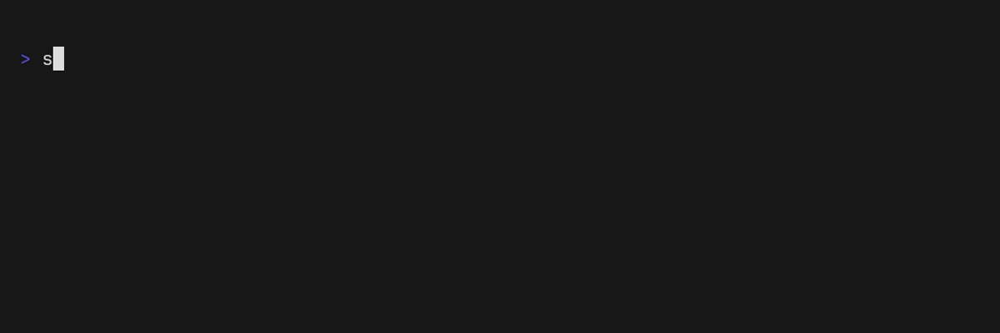
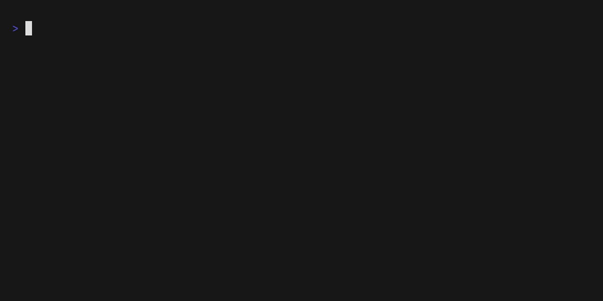

# Usage

SeReTo provides a *command line interface (CLI)* to help you create and manage your projects. After you have [set it up](getting_started/installation.md), you can continue with the following steps.


## Getting help

Any time you are unsure about anything, or cannot remember a command structure, you can always check the command's help:

```sh
sereto --help
```

You can also use help in the nested commands. For example, if you would like to know, what you can do with the dates in your project's configuration, you can run:

```sh
sereto config dates --help
```

## Create project

To create a new project using SeReTo, you can use the `new` command. The command takes a unique identifier for the project as a positional argument. For example, to create a project with the identifier `TEST`, you would run the following command:

```sh
sereto new TEST
```

During the creation process, you will be prompted with questions about the project, such as its name. Please provide the necessary information when prompted.

Please note that the project identifier should meet the following requirements:

- It can only contain letters (`a-zA-Z`), numbers (`0-9`), underscore (`_`), dash (`-`), and dot (`.`).
- It should be between 1 and 20 characters long.

For more information on the `new` command, you can refer to the [SeReTo CLI documentation](reference/cli/cli.md#sereto.cli.cli.new).


## List projects

You can see the list of all projects using the following command, which will show you the ID and name of the project, as well as the location of the project's file structure:

```sh
sereto ls
```




## Configuring the project's details

SeReTo will need some information from you to generate the project. In our example, please change your working directory to your project's directory (you can discover it by running `sereto ls`). It can look something like this:

```
cd projects/TEST
```

Now you can change the project's configuration. You should set up the **dates**, **targets** and **people** for the project.

To view a summary of the current configuration, you can run:

```sh
sereto config show
```

### Dates

Run the following command:

```sh
sereto config dates add
```

SeReTo will ask you which date you would like to configure:

* *sow_sent* = date when you will be sending your Statement of Work
* *pentest_ongoing* = pair of dates indicating when the assessment will be performed
* *review* = date when the review is going to be done
* *report_sent* = date when you will be delivering the report to your customer

You then set the dates using the format DD-Mmm-YYYY, such as 18-Apr-2024.


Run this command multiple times for each type of date you would like to set.

### Targets

Run the following command:

```sh
sereto config targets add
```

SeReTo will ask you about some details you would like to set. Make sure to include all necessary details, such as destination IP addresses (dst_ips), source IP addresses (src_ips), list of URLs etc.


Run this command multiple times for each target.


### People

Run the following command:

```sh
sereto config people add
```

SeReTo will let you choose the role (type) and details of the person you are currently setting.



Run this command multiple times for each person you would like to set.


## Adding findings to a target

The findings TUI allows you to add findings for a target in an interactive way. To start it, run the following command:

```sh
sereto findings add
```

To exit the TUI at any point, press `Ctrl+Q`.

The TUI utilizes fuzzy search to help you effectively locate the desired finding templates. You can filter the list by selecting specific categories and by searching for a finding’s title and/or keywords.

Once you select a finding, a scrollable preview is displayed. Pressing `A` opens a screen where the details of the findings can be filled in. It is required to enter the finding name, choose a target to which the finding will be added and specify all required variables from the template (e.g. image proof). After confirmation, the finding will be added to the specified target.

Once a finding is added, it is included in the *findings.toml* file of the target and a corresponding `.md.j2` file is created in the `findings` directory of the target. The `.md.j2` file is a Markdown Jinja template that should be edited to include specific details about the finding.


### Editing the finding template

#### *findings.toml*

When you add a finding from the TUI, the file *findings.toml* in the target's directory, e.g. `target_dast_example_target`, is updated. It may look as follows:

```toml
["Remote code execution"]
risk = "critical"
findings = ["generic_test_finding"]
```

The `Remote code execution` is the name of the **finding group**, `risk` is the risk level of the finding group, and `findings` is a list of one or more nested findings that belong to the group. Specifying the risk for a group is optional. If not specified, it defaults to the highest risk within the finding group.

#### Template file

The entry `generic_test_finding` depends on the template chosen from the TUI. In this case, it refers to a generic finding template. The corresponding file, `generic_test_finding.md.j2`, is created in the `findings` directory of the target, e.g. `target_dast_web/findings`. This file is a Jinja template that will be used to generate the report section for the given finding.

You can rename the template file to better reflect the nature of the finding, e.g. `rce.md.j2`. Remember to update the corresponding entry in the *findings.toml* file so that it matches the new file name, e.g.:

```toml
["Remote code execution"]
risk = "critical"
findings = ["rce"]
```

Individual findings may require you to fill in extra information, such as screenshots, which will be used to customize the finding in automated way. Specify these in the frontmatter of the template file, which is a section at the top of the file enclosed between `+++` lines.

The finding template should be an extension of the base template named `_base.md.j2`. This template provides the following blocks that you can override to customize the content of the finding:

- `description`
- `likelihood`
- `impact`
- `recommendation`

In its simplest form, the template may look like this:

```jinja
+++
name = "Remote code execution"
risk = "critical"
category = "generic"
template_path = "categories/generic/findings/test_finding.md.j2"

[variables]
images = ['proof.png']
+++




A brief description of the finding.

Image proof:

  





Likelihood of the finding being exploited.



Potential impact of the finding.



Recommendations or fixes for the finding.



References and links (e.g. to documentation) related to the finding.

```


## Report generation

To generate the report PDF, you can use the `pdf` command:

```sh
sereto pdf report
```

To open the generated report, you can use the `open` command:

```sh
sereto open report
```

In case of an error, check the `.build/report.log` file in your project's directory. It contains the output of the report generation process, including any errors that may have occurred.

To clean the auxiliary files generated during the report generation, delete the `.build` directory in the project's directory:

```sh
rm -r .build
```
